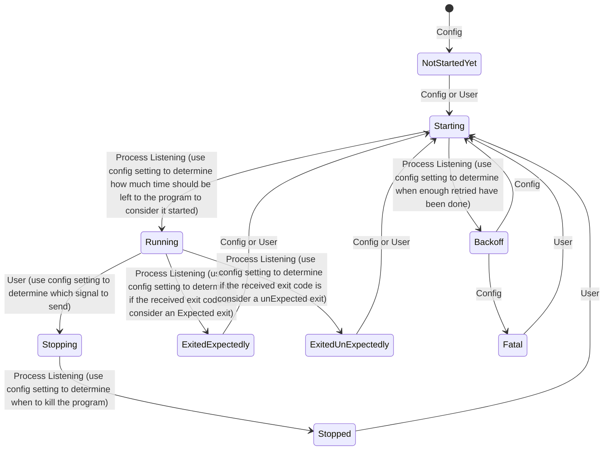

# Monitoring State Machine

```mermaid
stateDiagram
    [*] --> NotStartedYet : Config
    NotStartedYet --> Starting : Config or User
    Starting --> Running : Process Listening (use config setting to determine how much time should be left to the program to consider it started)
    Starting --> Backoff : Process Listening (use config setting to determine when enough retried have been done)
    Running --> Stopping : User (use config setting to determine which signal to send)
    Running --> ExitedExpectedly : Process Listening (use config setting to determine if the received exit code is consider an Expected exit)
    Running --> ExitedUnExpectedly : Process Listening (use config setting to determine if the received exit code is consider a unExpected exit)
    Backoff --> Starting : Config
    Backoff --> Fatal : Config
    Stopping --> Stopped : Process Listening (use config setting to determine when to kill the program)
    ExitedExpectedly --> Starting : Config or User
    ExitedUnExpectedly --> Starting : Config or User
    Fatal --> Starting : User
    Stopped --> Starting : User
```