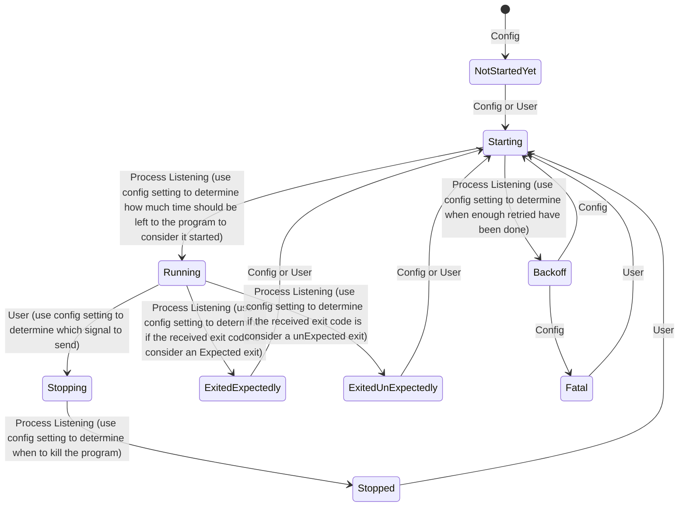

# Taskmaster

Taskmaster is a project developed as part of the 42 School curriculum. The goal of this project is to create a job control daemon, similar to `supervisor`, that can manage and supervise processes based on a configuration file. The program allows users to start, stop, restart, and monitor processes, as well as reload the configuration dynamically.

In our implementation, we have extended the project by introducing a **client/server architecture**, where the server handles the job control and the client provides an interactive shell for the user to manage the processes.

## Features

- **Job Control**: Start, stop, restart, and monitor processes.
- **Configuration File**: Define processes to supervise, including command, number of processes, auto-start, restart policies, and more.
- **Dynamic Configuration Reload**: Reload the configuration file without stopping the main program by sending a `SIGHUP` signal.
- **Logging System**: Log events such as process starts, stops, restarts, and unexpected deaths to a local file.
- **Interactive Shell**: A control shell for users to interact with the job control daemon.
- **Client/Server Architecture**: 
  - **Server**: Runs as a daemon and manages the processes.
  - **Client**: Provides an interactive shell to communicate with the server and control the processes.

## Run the project

Run the server:

```
cargo run --bin server
```

Run the client:

```
cargo run --bin client
```

## Configuration

The configuration file defines the programs to be supervised. Here is an example configuration file in YAML format:

```yaml
  nginx:
    cmd: "ping google.com"
    numprocs: 2
    umask: 77
    workingdir: /tmp
    autostart: true
    autorestart: unexpected
    exitcodes:
      - 0
      - 2
    startretries: 3
    starttime: 5
    stopsignal: SIGTERM
    stoptime: 5
    stdout: /tmp/nginx.stdout
    stderr: /tmp/nginx.stderr
    env:
      STARTED_BY: taskmaster
      ANSWER: 42

  vogsphere:
    cmd: "/bin/ls"
    numprocs: 2
    umask: 77
    workingdir: /tmp
    autostart: true
    autorestart: unexpected
    exitcodes:
      - 0
      - 2
    startretries: 3
    starttime: 5
    stopsignal: SIGUSR1
    stoptime: 10
    stdout: /tmp/vgsworker.stdout
    stderr: /tmp/vgsworker.stderrprograms
    fatal_state_report_address: "127.0.0.1:8080"
```

## Monitoring State Machine


